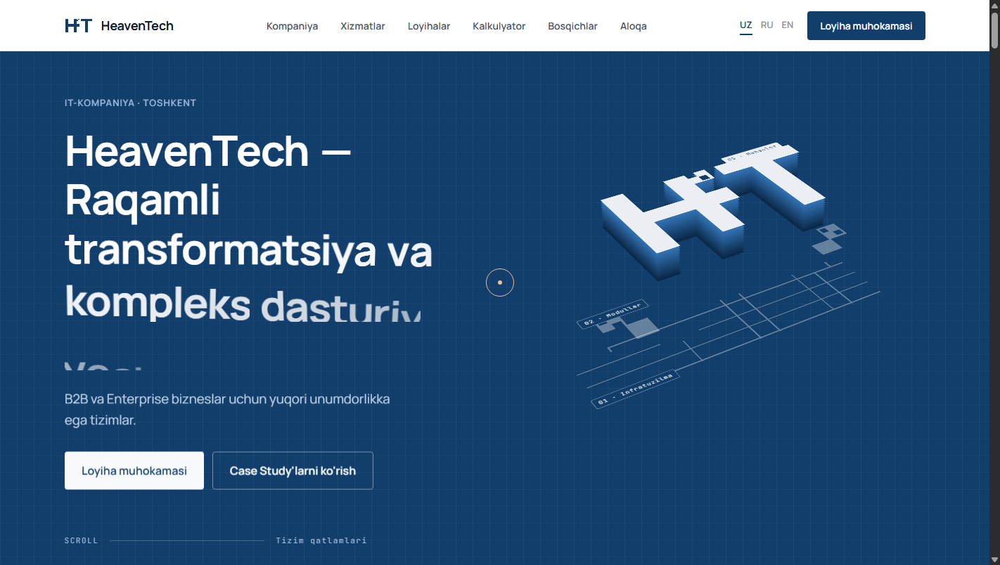

# HeavenTech — Korporativ Veb-Platformasi

> **USAD.UZ** kichik yakkaxon/jamoaviy landing page-saytining to'liq siklli, Enterprise darajasidagi **HeavenTech** korporativ veb-platformasiga transformatsiyasi.



---

## 🚀 Loyiha Haqida

**HeavenTech** — raqamli transformatsiya va kompleks dasturiy yechimlar yaratuvchi IT-kompaniya platformasi. Ushbu platforma B2B va Enterprise bizneslar uchun mo'ljallangan bo'lib, zamonaviy interaktiv 3D animatsiyalar, loyiha kalkulyatori va ko'p tillilik tizimiga ega.

### 🌟 Asosiy Imkoniyatlar:
- **3D Isometric HT Logo:** Chuqurlik va qatlamlar animatsiyasi (Infratuzilma, Modullar, Mahsulot).
- **Interaktiv Loyiha Kalkulyatori:** B2B mijozlar uchun xizmatlar, qo'shimcha modullar va muddat bo'yicha narxni real-vaqt rejimida hisoblash.
- **Multilingual (UZ, RU, EN):** O'zbekcha, Ruscha va Inglizcha tillarida silliq animatsiyali o'tish (i18n).
- **Gorizontal Xizmatlar Slayderi:** Enterprise CRM & ERP, Telegram Mini Apps, SaaS, Mobil ilovalar va DevOps xizmatlari.
- **B2B Case Study & ROI Metriklari:** Real vaqtda muammo, yechim, texnologiyalar va natijalarni foizlarda ko'rsatish.
- **Interaktiv RFP Modal:** Loyihani muhokama qilish va ariza yuborish formasi.
- **100% Offline va Tezkor:** Tashqi sekin CDN'larga bog'lanmagan lokal React va ReactDOM bundle'lari.

---

## 🛠 Texnologik Stak
- **Core:** HTML5, CSS3, Modern ES6+ JavaScript
- **View Layer:** React 18, ReactDOM (Stand-alone UMD)
- **Animatsiyalar:** Web Animations API, 3D CSS Transforms, Smooth scroll observer
- **Server:** Node.js HTTP Server

---

## 💻 Mahalliy Ishga Tushirish (Localhost)

1. Repozitoriyani klonlash:
```bash
git clone https://github.com/ODcoder23/heaventech-uz.git
cd heaventech-uz
```

2. Saytni ishga tushirish:
```bash
node server.js
```
yoki
```bash
npm start
```

3. Brauzerda ochish:
```
http://localhost:3000
```

---

## 🌐 Domen Ulash (Custom Domain Setup)

Sayt statik HTML/JS formatida yaratilganligi sababli quyidagi platformalarda osonlikcha domen bilan ishga tushiriladi:
- **GitHub Pages:** Repozitoriya sozlamalarida (`Settings` -> `Pages`) branch: `main`, folder: `/ (root)` tanlab, `Custom domain` bo'limiga domeningizni kiritasiz.
- **Vercel / Cloudflare Pages:** GitHub orqali 1 marta ulab, DNS sozlamalariga A / CNAME yozuvlarini yo'naltirasiz.

---

## 📄 Litsenziya
© 2026 HeavenTech IT Company. Barcha huquqlar himoyalangan.
